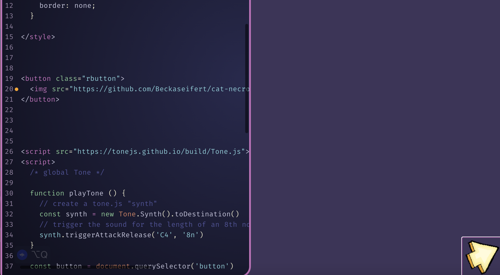

# cat-necromancy

[link to project](https://beckaseifert.github.io/cat-necromancy/)

First test for ideas on Final project, in INternet Artware class. Utilizes the button function, While replaceing the image of the button with a gif I created. THe button also uses the Tone Library, to give sound to the button. There is also code for a mouse trail to happen, but at the moment it is a work in progress.
